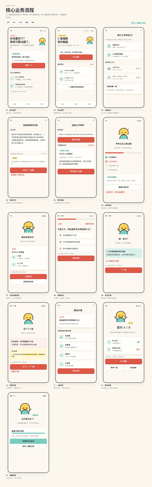
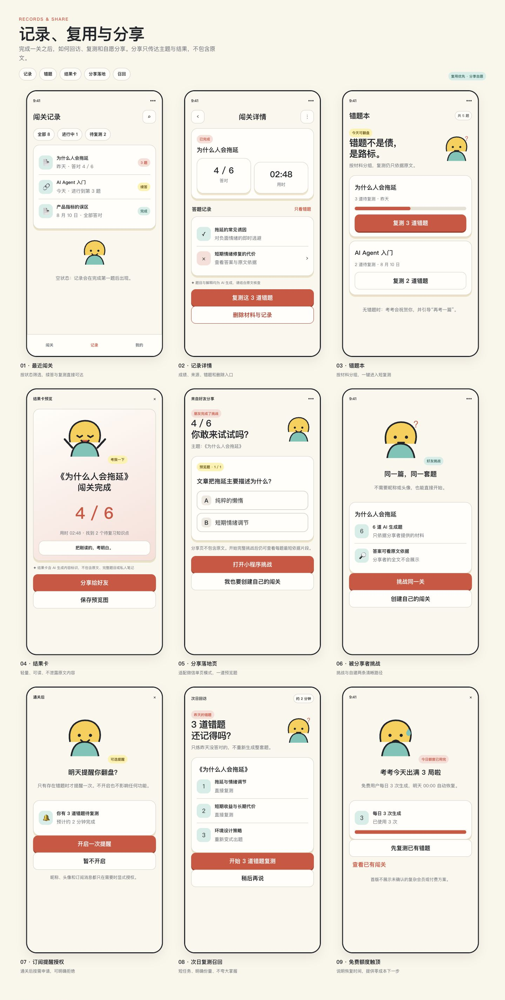
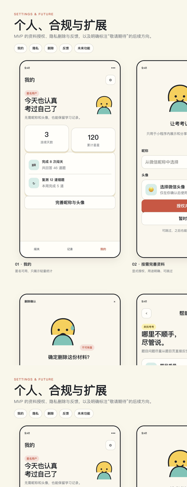

# UI 原型图

本文档汇总「考我一下」已经确认的正式 UI 原型，作为产品、设计、微信小程序前端和后端联调的统一页面索引。

> 产品定位：微信里最快的可溯源读后自测——只根据用户提供的内容出题，约 3 分钟完成一关，每道题都能回到原文，之后只复测错题。

## 1. 如何查看

正式原型共 3 组、32 个画板，均为一行三列的响应式 HTML 页面，包含可点击交互。

| 原型组 | HTML | 画板数 | 覆盖范围 |
| --- | --- | ---: | --- |
| 核心业务流程 | [打开原型](prototypes/codex-core-flow.html) | 13 | 首页、材料输入、AI 生成、答题、反馈、结果、错题复测 |
| 记录、复用与分享 | [打开原型](prototypes/codex-records-share.html) | 9 | 闯关记录、错题本、分享、订阅召回、免费额度 |
| 个人、合规与扩展 | [打开原型](prototypes/codex-settings-future.html) | 10 | 个人页、授权、隐私、删除、反馈和未来入口 |

本地查看命令：

```bash
python3 -m http.server 4173
```

然后访问：

```text
http://127.0.0.1:4173/prototypes/codex-core-flow.html
http://127.0.0.1:4173/prototypes/codex-records-share.html
http://127.0.0.1:4173/prototypes/codex-settings-future.html
```

共用实现文件：

- `prototypes/codex-styles.css`：正式视觉系统、三列响应式布局、焦点态与减弱动效；
- `prototypes/codex-app.js`：画板切换、选项作答、证据抽屉、弹层、文本计数和生成阶段演示；
- `tests/test_prototypes.py`：页面、品牌、画板、交互和本文档完整性契约测试。

## 2. 已确认的视觉与交互基线

| 项目 | 决策 |
| --- | --- |
| 产品名 | 考我一下 |
| 口号 | 把刚读的，考明白。 |
| 原创角色 | 考考；陪用户犯错和核查证据的学习搭档，不是老师 |
| 风格 | 面向成年人的大胆卡通“爆笑练习册” |
| 视觉原则 | 界面负责阅读，SVG 负责卡通 |
| 背景色 | 暖纸底 `#FBF7EE` |
| 主行动色 | 珊瑚红 `#DE5848` |
| 辅助色 | 薄荷青 `#78CDBF` |
| 奖励色 | 奖励黄 `#FFD45A` |
| 正文色 | 深灰 `#24292D` |
| 字体 | 高可读系统无衬线中文字体；标题、题干、正文、选项和按钮禁用楷体、仿宋与手写体 |
| 正误表达 | 颜色之外同时使用图标和文字 |
| 可访问性 | 键盘焦点可见，支持 `prefers-reduced-motion` |

卡通风格只由原创 SVG 角色、气泡、印章和轻量漫画动效承担。不得复制《阿衰》的角色外形、服装、姓名、标志性构图、台词或封面字体。

## 3. 核心业务流程



主流程：

```text
首次或回访首页
  → 选择输入方式
  → 粘贴文本或公开网页
  → 后台生成与自动校验
  → 逐题作答和即时反馈
  → 查看原文依据或纠错
  → 通关结果
  → 错题复测
```

| 编号 | 页面与原型锚点 | 业务目的 | 开发要点 |
| --- | --- | --- | --- |
| 01 | [首次首页](prototypes/codex-core-flow.html#first-home) | 让新用户立即理解价值并开始 | 静默识别，不以登录、昵称或头像阻断 |
| 02 | [回访首页](prototypes/codex-core-flow.html#return-home) | 优先承接最重要的未完成任务 | 优先级固定为错题复测 → 续答 → 创建新闯关 |
| 03 | [选择输入](prototypes/codex-core-flow.html#input-picker) | 选择材料来源 | 文本和公开网页可用；拍照和文件禁用并标“敬请期待” |
| 04 | [粘贴文本](prototypes/codex-core-flow.html#text-input) | 提交原始文字材料 | 最多 8,000 个中文字符，实时计数，超限不得静默截断 |
| 05 | [网页链接](prototypes/codex-core-flow.html#url-input) | 解析并预览公开网页正文 | 不绕过登录、付费或验证码；失败后引导改粘贴文本 |
| 06 | [生成等待](prototypes/codex-core-flow.html#generation) | 表达后台任务进度 | 使用轮询；允许离开；展示理解、抓重点、生成和检查阶段 |
| 07 | [生成结果预览](prototypes/codex-core-flow.html#generation-preview) | 开局前确认题量和预估时长 | 默认 5–7 题；材料不足时少出或拒绝，不凑题 |
| 08 | [逐题作答](prototypes/codex-core-flow.html#quiz-question) | 完成单选或判断题 | 选中后主动确认；原位反馈；常驻 AI 生成提示 |
| 09 | [答对反馈](prototypes/codex-core-flow.html#quiz-correct) | 给出克制庆祝、解释和证据 | 不自动跳题；用户阅读后手动进入下一题 |
| 10 | [答错反馈](prototypes/codex-core-flow.html#quiz-wrong) | 解释差异并收录错题 | 不羞辱用户；原文依据默认可见 |
| 11 | [一键纠错](prototypes/codex-core-flow.html#question-report) | 收集结构化题目质量反馈 | 固定支持无依据、答案错、有歧义、太简单 |
| 12 | [通关结果](prototypes/codex-core-flow.html#quiz-result) | 汇总本次表现并给出下一步 | 首要行动是错题复测，其次再考一篇，分享自愿 |
| 13 | [错题复测](prototypes/codex-core-flow.html#wrong-retest) | 用短回合闭环错题 | 只表示本次复测表现，不宣称用户已经掌握 |

## 4. 记录、复用与分享



| 编号 | 页面与原型锚点 | 业务目的 | 开发要点 |
| --- | --- | --- | --- |
| 01 | [最近闯关](prototypes/codex-records-share.html#recent-list) | 查看已完成、进行中和待复测任务 | 续答与复测应一跳可达 |
| 02 | [记录详情](prototypes/codex-records-share.html#record-detail) | 查看成绩、答题记录和材料状态 | 支持只看错题、查看证据和删除入口 |
| 03 | [错题本](prototypes/codex-records-share.html#wrong-book) | 按材料组织待复测题目 | 无错题时引导再考一篇，不制造焦虑 |
| 04 | [结果卡](prototypes/codex-records-share.html#result-card) | 生成可自愿分享的轻量结果 | 不包含原文、完整题目或私人笔记 |
| 05 | [分享落地页](prototypes/codex-records-share.html#share-landing) | 在微信单页模式承接好友 | 可展示一道预览题，不展示分享者全文 |
| 06 | [被分享者挑战](prototypes/codex-records-share.html#shared-challenge) | 进入同材料同题挑战或自建闯关 | 不要求昵称头像；明确两条独立路径 |
| 07 | [订阅提醒授权](prototypes/codex-records-share.html#subscribe-request) | 在有错题时申请一次提醒 | 显式授权、可拒绝，不影响其他功能 |
| 08 | [次日复测召回](prototypes/codex-records-share.html#next-day-recall) | 直接回到昨天的短复测 | 只练错题，不重新生成整套题 |
| 09 | [免费额度触顶](prototypes/codex-records-share.html#quota-limit) | 解释每日生成限制 | 告知恢复时间，并提供复测和历史记录作为免费下一步 |

分享不得用于解锁、奖励、续命或强制完成任务。首版不引入多人 PK、排行榜和复杂会员体系。

## 5. 个人、合规与扩展入口



| 编号 | 页面与原型锚点 | 上线阶段 | 开发要点 |
| --- | --- | --- | --- |
| 01 | [我的](prototypes/codex-settings-future.html#profile) | MVP | 匿名可用，只展示轻量统计 |
| 02 | [按需完善资料](prototypes/codex-settings-future.html#profile-consent) | MVP | 昵称头像仅在需要时显式授权，可跳过和撤回 |
| 03 | [隐私与数据](prototypes/codex-settings-future.html#privacy-data) | MVP | 材料默认私有、短期保存、用户可主动删除 |
| 04 | [删除确认](prototypes/codex-settings-future.html#delete-confirm) | MVP | 明确级联删除范围和不可恢复后果 |
| 05 | [帮助与反馈](prototypes/codex-settings-future.html#help-feedback) | MVP | 产品问题、题目质量、网页读取和版权投诉分流 |
| 06 | [拍照导入](prototypes/codex-settings-future.html#future-photo) | 未来 | 仅展示禁用入口和“敬请期待” |
| 07 | [文件导入](prototypes/codex-settings-future.html#future-file) | 未来 | PDF / Word / PPT 均不做实际解析 |
| 08 | [题量与难度](prototypes/codex-settings-future.html#future-difficulty) | 未来 | MVP 不暴露复杂参数，保持约 3 分钟一局 |
| 09 | [间隔复习](prototypes/codex-settings-future.html#future-review-plan) | 未来 | MVP 只做错题复测，不承诺复杂复习计划 |
| 10 | [成就贴纸册](prototypes/codex-settings-future.html#future-stickers) | 未来 | 轻量奖励真实完成与复测，不做排行榜 |

## 6. 前后端开发映射

以下是从页面行为推导的首版能力边界。具体字段、状态码和命名以 `技术方案.md` 及最终 OpenAPI 契约为准。

| 领域能力 | 主要页面 | 前端状态 | 后端职责 |
| --- | --- | --- | --- |
| 用户识别 | 首次首页、我的 | 匿名态、按需授权态 | 静默 `openid`，授权资料独立保存 |
| 材料输入 | 选择输入、文本、网页 | 输入中、校验失败、解析预览 | 文本校验、公开网页正文提取、风险拒绝 |
| 题目生成 | 生成等待、生成预览 | `queued`、`processing`、`succeeded`、`failed` | 后台任务、5–7 题生成、限源和质量校验 |
| 答题 | 逐题作答、正误反馈 | 未选、已选、已提交、已解释 | 校验答案、记录作答、返回解析和 `source_span` |
| 题目纠错 | 一键纠错、帮助反馈 | 未提交、已提交 | 保存结构化反馈并关联题目版本 |
| 结果与复测 | 结果、错题本、复测 | 完成、待复测、复测完成 | 聚合本局结果，只抽取错题形成短回合 |
| 记录 | 最近闯关、详情 | 空、进行中、已完成、已删除 | 查询、续答、级联删除 |
| 分享 | 结果卡、落地页、好友挑战 | 分享预览、单页模式、挑战准备 | 生成不泄露原文的分享摘要和挑战凭证 |
| 订阅 | 授权、次日召回 | 未申请、同意、拒绝 | 只在有错题时发送一次合法订阅提醒 |
| 额度 | 首页、额度触顶 | 剩余次数、恢复时间 | 每日生成计数与幂等扣减 |

每一道 AI 题目必须至少具备：

```text
question_id
question_type
stem
options
correct_answer
explanation
source_span
quality_status
```

前端不得自行补充材料外知识；后端无法提供直接证据时，应少出题或拒绝出题。

## 7. 实施优先级

### P0：打通可用闭环

首次首页、选择输入、文本输入、网页输入、生成等待、生成预览、逐题作答、正误反馈、题目纠错、通关结果、错题复测。

### P1：形成复用闭环

回访首页、最近闯关、记录详情、错题本、隐私与数据、删除确认、帮助反馈、额度触顶。

### P2：上线后验证

结果卡、分享落地页、好友挑战、订阅提醒、次日召回、按需完善资料。

### Future：只保留入口

拍照导入、文件导入、题量与难度、间隔复习、成就贴纸册。开发 MVP 时不得把这些原型误解为已进入首版范围。

## 8. 开发验收清单

- 页面信息层级、文案和主行动与对应画板一致；
- 390 px 手机宽度无横向溢出、遮挡或不可点击元素；
- 生成和网页读取的失败态均提供明确下一步；
- 正误状态同时具备颜色、图标和文字，不仅依赖色彩；
- 所有题目、解释和结果页面保留 AI 生成提示；
- 每题均能查看最短、直接支持答案的 `source_span`；
- 键盘焦点可见，减弱动效设置有效；
- 昵称、头像、订阅提醒均可跳过；
- 分享不解锁功能、不发奖励、不泄露原文；
- 拍照和文件等未来入口禁用并显示“敬请期待”；
- 不出现“已掌握”“零幻觉”等夸大效果表述。

## 9. 文件来源说明

本文档只汇总 Codex 正式原型：

- `prototypes/codex-core-flow.html`
- `prototypes/codex-records-share.html`
- `prototypes/codex-settings-future.html`
- `prototypes/codex-styles.css`
- `prototypes/codex-app.js`

`prototypes/core-flow.html`、`prototypes/extended-features.html`、`prototypes/states-compliance.html` 和 `prototypes/styles.css` 是 Claude Code 生成的早期参考稿，只作为历史参考保留，不代表正式品牌、视觉和页面规范。

当本文档、旧参考稿或其他设计材料冲突时，按 `AGENTS.md` 中的权威资料优先级处理；用户最新明确决定始终优先。
