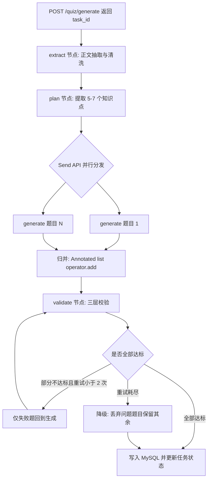
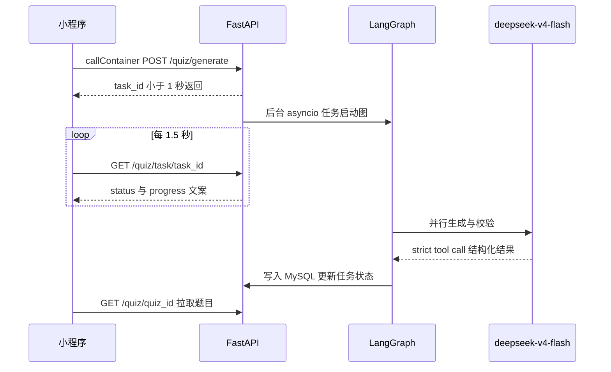
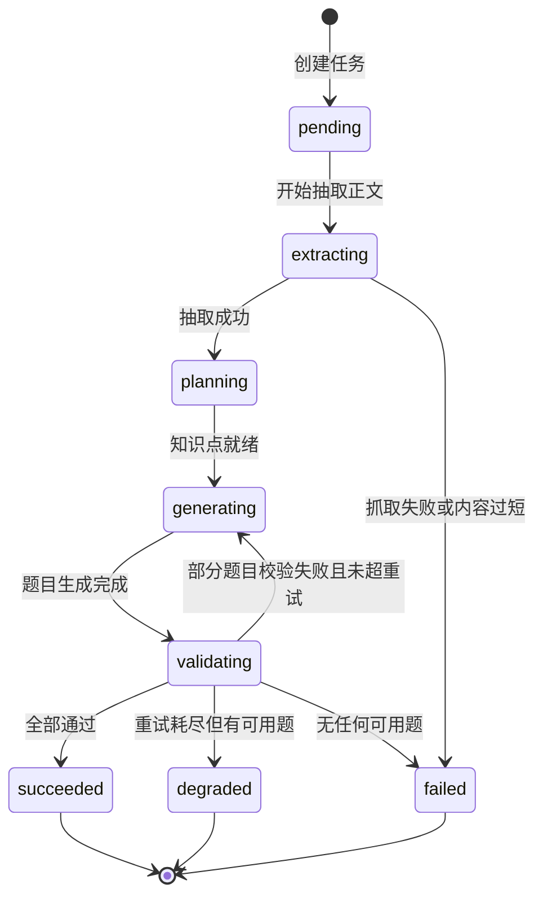

# 技术方案文档

> 文档版本：v1.0　｜　更新日期：2026-08-13
> 需求边界见 `需求分析.md`，市场与竞品证据见 `竞品调研资料.md`。
> 本文档只承载技术决策。所有版本号与价格均为 2026-08-13 核实值。

---

## 1. 选型总表

| 层次 | 选型 | 版本 | 说明 |
| --- | --- | --- | --- |
| 小程序框架 | 微信小程序原生 | — | 只做微信端，无跨端需求 |
| 小程序语言 | TypeScript | — | 官方模板直接支持 |
| 渲染引擎 | WebView 起步 | — | 答题页后期单独试点 Skyline |
| UI 组件库 | TDesign 小程序 | `1.16.0` | 2026-08-06 仍活跃发布 |
| 后端语言 | Python | `3.11+` | LangGraph CLI 要求 ≥3.11 |
| Web 框架 | FastAPI | 最新稳定版 | 异步原生，适合 LLM 调用 |
| AI 编排 | LangGraph | `1.2.11` | MIT 协议，1.0 起为 LTS |
| LLM 抽象层 | LangChain | `1.3.x` | 与 LangGraph 版本依赖锁死 |
| 主力模型 | `deepseek-v4-flash` | — | Beta 端点 + strict tool calling |
| 模型 SDK | `langchain-deepseek` | `1.1.0` | 三家中唯一官方 partner 包 |
| 备用模型 | `glm-4.7` | — | `ChatOpenAI` 指向智谱兼容端点 |
| 可观测性 | LangSmith | 免费档 | 5k traces/月，14 天保留 |
| 部署 | 微信云托管 | — | Docker 容器，免 ICP 备案 |
| 数据库 | MySQL | 云托管自带 | 同时承载业务数据与任务状态 |

**升级路径：** 若 `deepseek-v4-flash` 质量不足，同协议换 `deepseek-v4-pro`，只改 model 名。

---

## 2. 前端选型

### 2.1 为什么是原生而不是 Taro

Taro 的唯一硬优势是跨端（一套代码编译到支付宝/抖音小程序、H5、React Native），而本项目明确只做微信，这个优势拿不到。付出的代价却是实打实的：多一层编译产物导致调试时要在源码和 `dist/` 之间来回定位；微信新能力（Skyline、glass-easel）需要等 Taro 适配才能用。

简历价值上的差别也没有想象中大。这个项目真正值得讲的是后端的编排设计、结构化输出约束和质量校验闭环，前端用什么框架不是面试会追问的点。因此前端选最省时间的方案，把工期投到后端。

### 2.2 关于 Skyline

官方对全新项目的建议原文是「建议直接全局打开」，但对本项目收益/成本比不划算。Skyline 的核心卖点是 worklet 动画、手势系统、共享元素动画、长列表流畅度，而本应用是「粘贴文本 → 等待 → 看题目」的表单式交互，几乎用不上。代价则包括 WXSS 大幅精简需重新适配样式、PC 端 fallback 到 WebView 导致两套渲染都要验证。

需要注意 Skyline **默认不生效**：官方接入了 We 分析 AB 实验，未配置时页面仍走 WebView。若要启用需在 `app.json` 显式配置 `rendererOptions.skyline.disableABTest: true`。另外 Windows / Mac 端至今未支持。

首版全部走 WebView。后续若想试点，Skyline 支持按页面/分包粒度渐进开启，把答题页单独打开即可，成本可控。

### 2.3 UI 组件库

选 TDesign 小程序，除了维护活跃（`1.16.0` 发布于 2026-08-06），还有一个对本项目对口的点：新增了 `ChatRecord` / `ChatSender` 对话类组件，「输入内容 → 看到生成进度」的界面能省掉不少工作。

**避坑：** Vant Weapp（`@vant/weapp`）最后一次发布是 2024-10-14，已事实停更近两年。网上大量 2023–2024 年的小程序教程仍在推荐它。

---

## 3. 模型选型

### 3.1 核心事实：三家都不支持严格 json_schema

GLM、MiniMax、DeepSeek 均**不支持** `response_format: {"type":"json_schema"}`：

- **智谱 GLM**：官方 API 规范中 `response_format.type` 枚举只有 `text` 和 `json_object`，GLM-4.7 / 5 / 5.1 / 5.2 全部如此。这不是型号差异，是平台层面就没有这个参数。官方结构化输出指南给出的范式是「把 JSON Schema 写进 system prompt + 用 `json_object` + 客户端自行校验」。
- **MiniMax**：主推的 M 系列连 `response_format` 参数都不存在（官方 OpenAPI 规范中搜不到该字段）。唯一支持它的 `MiniMax-Text-01` 是 2025 年的老模型，已不在当前计费表内。
- **DeepSeek**：只有 `json_object`，且官方自曝「API 有概率会返回空的 content」。

> 网上流传的「GLM 支持 json_schema」不准确——那是阿里云百炼等第三方托管平台在网关层实现的能力，不等于智谱自家 API。

**直接结论：** `with_structured_output(method="function_calling")` 不是降级方案，而是唯一方案。

### 3.2 三层风险与兜底手段

题目质量的保障必须分三层设计，每层的兜底手段完全不同：

| 层次 | 风险 | 兜底手段 | 谁来保证 |
| --- | --- | --- | --- |
| 第 1 层 | 结构合法性：字段缺失、类型错误、多余字段 | DeepSeek Beta 端点 strict tool calling | **服务端** |
| 第 2 层 | 数量约束：题数、选项数不符 | Pydantic `Field(min_length, max_length)` + 重试 | 应用层 |
| 第 3 层 | 语义正确性：`source_span` 是否真在原文、`answer_index` 是否真的对 | 自建 `validate` 节点 | 应用层 |

**第 2 层为什么不能靠 schema：** DeepSeek strict 模式明确不支持 `minItems` / `maxItems` 关键字。即便开了 strict，模型照样可能返回 4 道题或 9 道题。

**第 3 层是产品生死线。** `source_span` 必须是原文中真实存在的片段，`answer_index` 必须真的指向正确选项——这两条任何模型的结构化输出能力都替代不了。校验实现：`source_span` 做原文子串匹配（归一化空白与全半角后再比对），索引做越界检查。

### 3.3 为什么主力选 DeepSeek

选它的**唯一理由**是第 1 层：它是三家中唯一提供**服务端 JSON Schema 校验**的。开启方式是 `base_url="https://api.deepseek.com/beta"` 且 `tools` 中 function 设 `strict: true`，官方明确说明「模型在输出 Function 调用时会严格遵循 JSON Schema 的格式要求」，且「服务端会对用户传入的 JSON Schema 进行校验」。这把「模型自由发挥」降级成「服务端按 schema 约束解码」，是质的差别。

附带优势：strict 模式在思考与非思考模式下均可用（无冲突）；`langchain-deepseek` `1.1.0`（2026-06-03 发布）是三家中唯一活跃维护的官方 partner 包，`ChatDeepSeek.with_structured_output` 在 `strict=True` 时会自动切到 beta 端点。

选 `flash` 而非 `pro`：输入 1 元 / 输出 2 元，是 pro 的三分之一，并发限制 2500（pro 为 500）。先跑通再按实测质量决定是否升级。

### 3.4 被否决的选项

**MiniMax（不建议用于本场景）**

- 主推 M 系列无 `response_format` 参数，唯一路径是 tool calling 且无服务端强制
- LangChain 生态双重空白：`langchain-community` 已被官方宣布 sunset（2026-05-22，原文「This sunset will take effect immediately」），`langchain-minimax` 的 PR #36292 于 2026-06-12 关闭未合并，PyPI 上无此包
- M2.x 系列 thinking 无法关闭（官方原文：即使传入 `thinking: {"type":"disabled"}` 仍保持开启），思考 token 按输出价计费，高频短任务的成本与延迟不可控

**GLM 作主力（降为备用）**

function calling 成熟、文档质量三家最好、无涨价预告，但没有服务端 schema 强制，第 1 层风险要全部压到应用层。另外没有官方 LangChain 包（`langchain-zhipu` 停更在 2024-07），需用 `ChatOpenAI` 指向 `https://open.bigmodel.cn/api/paas/v4/`。

作为备用模型时选 4.7 而非 GLM-5：本任务是抽取式的，不需要旗舰推理能力，4.7 便宜一半且 200K 上下文绰绰有余。

### 3.5 待确认的价格风险

DeepSeek 于 2026-08-06 在官网定价页与邮件中公告：「计划近期整体上调 DeepSeek API 服务的定价，**预计涨幅较大**」。截至 2026-08-13，新价格数字、涨幅、生效日期官方一概未公布，现行价格仍有效。

由于本项目单次成本绝对值极低（约 0.01 元），涨价不足以改变选型结论，但**成本模型不应锁死在当前价格上**。

---

## 4. 后端架构

### 4.1 为什么不用 LangGraph Platform

「LangGraph Platform / LangGraph Server」已整体改名为「LangSmith Deployment / Agent Server」。自托管生产环境需要 `LANGGRAPH_CLOUD_LICENSE_KEY`，**不免费**：Developer 档的 Deployment 明确标注 N/A，Plus 从 $39/seat/月起。

而 `langgraph` 库本身是 MIT 协议、完全免费，官方也明确说它「can be used without LangChain」。Agent Server 提供的 assistants / threads / runs 抽象、后台任务队列、cron、断点续跑，对「一次性生成 5-7 道题」的短流程基本是浪费，还会强制引入 Redis 运维负担。

**同理不配置 checkpointer。** 一次性 HTTP 请求的短流程用不上 durable execution 和 time travel，省掉 PostgreSQL 依赖。若后续要做多轮交互或人工审核介入，再补 `PostgresSaver` 也不迟——LangGraph 1.x 是 LTS，后补没有迁移成本。

### 4.2 LangGraph 编排设计



对应的官方模式：质量校验循环是 **evaluator-optimizer**，并行出题是 **Send API 的 map-reduce**。

**关键设计：** `validate` 失败时只让出问题的**单题**回到生成节点重试，不要因为 7 题里坏 1 题让另外 6 题陪葬。降级优于整体失败。

### 4.3 结构化输出写法

节点内直接调用模型，不套 `create_agent`——本项目不是 agent loop，套 agent 只会增加开销。

```python
from langchain_deepseek import ChatDeepSeek
from pydantic import BaseModel, Field

class Question(BaseModel):
    stem: str = Field(description="题干")
    options: list[str] = Field(min_length=3, max_length=4)
    answer_index: int = Field(ge=0, le=3)
    source_span: str = Field(description="必须是原文中真实存在的连续片段")
    explanation: str = Field(description="知识讲解")

# strict=True 会自动切到 /beta 端点，由服务端强制 schema
model = ChatDeepSeek(model="deepseek-v4-flash")
model_with_structure = model.with_structured_output(
    Question, method="function_calling", strict=True
)
```

Pydantic 的字段校验能免费拿到第 2 层的重试：校验失败会抛 `StructuredOutputValidationError`，`ToolStrategy` 的 `handle_errors` 默认为 `True`，会把错误包成 `ToolMessage` 回灌给模型重新生成。

**但官方文档未说明重试次数上限，必须在外层自己加计数熔断**，否则可能陷入无限重试并烧掉成本。

第 3 层的 `source_span` 原文比对是业务校验，`ToolStrategy` 不知道，只能在 `validate` 节点里自己写。

---

## 5. API 设计与任务状态机

### 5.1 为什么必须用轮询而不是流式

小程序**没有 `EventSource`**，标准 SSE 不可用。唯一的流式方案是 `wx.request({ enableChunked: true })` + `RequestTask.onChunkReceived`，但存在三个硬约束：

1. **默认超时 60 秒，且 60 秒就是最大值**，设更大不生效
2. 小程序**退到后台 5 秒内请求未结束会回调 `fail interrupted`**，且回前台前无法再发起请求
3. 声明 `enableChunked` 后会强制走 HTTP/1，与 HTTP/2 互斥

本项目的流程是「正文抽取 → 提取知识点 → 并行生成 5-7 题 → 三层校验 → 可能重试」，很可能超过 60 秒。因此改为**任务化 + 轮询**。

额外收益：用户退到后台再回来任务不会丢；服务端重启或超时可恢复；调试成本显著更低。

### 5.2 交互时序



### 5.3 任务状态机



`degraded` 是一个独立的终态而非失败：题目数量少于目标但仍可作答，前端正常进入闯关，只在埋点中单独标记。

### 5.4 接口清单

| 方法 | 路径 | 说明 |
| --- | --- | --- |
| POST | `/api/quiz/generate` | 提交文本或 URL，立即返回 `task_id` |
| GET | `/api/quiz/task/{task_id}` | 轮询任务状态与进度文案 |
| GET | `/api/quiz/{quiz_id}` | 拉取完整题目（含原文依据、解析） |
| POST | `/api/quiz/{quiz_id}/answer` | 提交单题作答 |
| POST | `/api/quiz/{quiz_id}/retest` | 基于错题生成复测 |
| GET | `/api/quiz/recent` | 最近闯关列表 |
| POST | `/api/question/{question_id}/feedback` | 一键纠错 |
| DELETE | `/api/material/{material_id}` | 用户删除原始内容 |

进度文案直接给用户可读的语言（「正在理解原文」「已生成第 3 题」「正在校验题目」），不要暴露内部节点名。

### 5.5 数据表

| 表 | 关键字段 | 说明 |
| --- | --- | --- |
| `user` | `openid`, `channel`, `created_at` | `channel` 支撑需求文档 M14 的人群分层 |
| `material` | `id`, `user_id`, `source_type`, `content_hash`, `raw_text`, `expire_at` | `expire_at` 落实短保留期；`content_hash` 用于缓存去重 |
| `task` | `id`, `material_id`, `status`, `progress`, `retry_count`, `error` | 对应 5.3 状态机 |
| `quiz` | `id`, `material_id`, `question_count`, `is_degraded` | |
| `question` | `id`, `quiz_id`, `stem`, `options`, `answer_index`, `source_span`, `explanation` | `source_span` 需通过原文比对才落库 |
| `attempt` | `id`, `quiz_id`, `user_id`, `started_at`, `completed_at`, `score` | 支撑完成率统计 |
| `answer` | `attempt_id`, `question_id`, `chosen_index`, `is_correct` | 错题复测的数据来源 |
| `feedback` | `question_id`, `user_id`, `error_type` | 支撑题目质量指标 |

`content_hash` 的缓存去重仅限同一用户复用，**不得跨用户共享受版权保护的内容**。

---

## 6. 部署方案

### 6.1 微信云托管：绕过 ICP 备案

这是本次选型中最关键的一条工期决策。官方明确说明：小程序通过 `wx.cloud.callContainer` 调用云托管服务走**微信私有协议**，因此不需要在小程序后台配置服务器域名，**也不需要域名备案**。

对 4–8 周的排期而言，备案是唯一无法靠加班压缩的串行环节（个人主体通常 1–3 周），绕过它相当于省下 20%–40% 的工期。

附带收益：`callContainer` 的请求头直接带 openid，省掉一整套 `code2session` 登录逻辑。

**注意区分「云托管」与「云开发」：** 要用的是云托管（Docker 容器），不是云开发（云函数）。云函数对 Python + LangGraph 这种依赖较重、执行时间长的场景不合适。

### 6.2 成本

| 项目 | 单价 | 首个环境免费额度（3 个月有效） |
| --- | --- | --- |
| CPU | 0.055 元 / 核·小时 | 720 核·小时 |
| 内存 | 0.032 元 / GB·小时 | 1440 GB·小时 |
| 构建时长 | 0.05 元 / 分钟 | 600 分钟 |
| 公网流量 | 0.8 元 / GB | 5 GB |
| MySQL 算力 | 0.342 元 / 个·小时 | 720 个·小时 |

按 1 核 2GB 常驻估算约 86 元/月。720 核·小时的免费额度够 1 核跑满 30 天，开发期基本免费。

### 6.3 云托管的三个官方警告

- 默认公网域名「仅能支持接口测试使用，请勿用于正式生产环境」，且无法配到小程序后台
- **没有固定公网出口 IP**（动态变化）——若模型厂商要求 IP 白名单会踩雷，DeepSeek 与智谱目前均不要求
- 暂未支持域名备案功能，官方建议「另外购买服务器专门做备案之用」

### 6.4 迁移预案

后端是标准 Docker 容器，若后续因成本或平台绑定需要迁到自建云服务器，迁移成本很低。届时再补备案（域名 ~50 元/年 + 腾讯云轻量 2核2G 约 99 元/年，全年约 100–150 元，比云托管便宜一个数量级）。

**结论：先用云托管跑通验证，等验证有人用了再谈迁移。**

---

## 7. 成本模型

单次生成的变动成本构成：

```
单次完成成本 =（正文抽取 + 输入 token + 题目输出 + 校验重试 + 内容审核 + 存储带宽）÷ 生成后完成率
```

按 8000 中文字输入估算（智谱官方换算约 1 汉字 : 1.6 token，约 5000 输入 token；输出 7 题含 `source_span` 与解析约 2000–3000 token）：

| 项 | 估算 |
| --- | --- |
| 单次生成（`deepseek-v4-flash`） | 约 0.01 元 |
| 含一轮校验重试 | 约 0.02 元 |
| 1000 次生成 | 约 20 元 |

**真正的成本风险不是单价，而是「长网页 → 生成很多题 → 用户只答 1 题」。** 控制手段：

- 输入长度硬上限 8000 中文字，超限要求用户选段
- 正文抽取去除导航、评论、广告
- 首轮只出 5–7 题，不一次性生成 20 题
- 题目 JSON 按 `content_hash` 缓存（仅同用户复用）
- 免费额度限制（建议每日 3 次生成）在首版即上线
- 不在免费层提供视频、扫描 PDF、无限再生成

需求文档设定的内部警戒线是**单次完成闯关 ≤ ¥0.10–0.30**，当前估算有充足余量。

---

## 8. 易踩点清单

**LangGraph / LangChain**

- `create_react_agent` 已废弃，正确写法是 `langchain.agents.create_agent`；本项目不用 agent，直接 `StateGraph`
- 消息类从 `langchain.messages` 导入，不是老的 `langchain_core.messages`
- `langchain` 与 `langgraph` 版本依赖锁死（`langchain 1.3.15` 要求 `langgraph >=1.2.11,<1.3.0`），必须成对升级
- LangGraph CLI 要求 Python ≥ 3.11，比 langgraph 库本身的 ≥3.10 更严

**模型调用**

- strict tool calling 必须走 `/beta` 端点
- strict 模式下每个 object 的所有属性都要列入 `required`，且加 `additionalProperties: false`
- `minItems` / `maxItems` 在 strict 模式下不生效，数量约束只能靠 Pydantic
- 备用模型 GLM 建议显式 `thinking: disabled`——抽取式任务不需要深度推理，还能省一大笔输出 token
- 智谱 `temperature` 区间是 `(0,1)`，不接受 0，与 OpenAI 默认值不同

**小程序**

- 服务器域名只支持 https/wss，不能用 IP 或 localhost，不能配父域名（走云托管则完全不需要配）
- 开发者工具的「不校验合法域名」仅限本地调试，提交审核会被拒
- `wx.request` 最大并发 10
- Skyline 默认不生效，需显式配 `disableABTest`
- Vant Weapp 已事实停更，不要用

---

## 9. 需实测确认项

以下问题官方文档答不了，必须在编码前用小脚本验证：

1. **`source_span` 的原文命中率**——这是产品体验的生死线，也是各模型差异可能最大的指标。应作为主力模型复核的首要基准，用 20–30 份真实中文材料建基准集。
2. 用真实的嵌套 schema 调 DeepSeek strict，确认服务端不会因 schema 复杂度报错（嵌套 array of object 文档支持，但深层嵌套与 `anyOf` 的实际边界只能试）。
3. `wx.cloud.callContainer` 是否支持 `enableChunked`，官方文档未说明。轮询方案在两种情况下都能工作，因此不阻塞开发。
4. LangChain 集成页仍在警告「`deepseek-reasoner` 不支持 tool calling」，对应的是 V3/R1 时代模型；需确认其 model profile 是否已认得 v4 系列模型名。
5. GLM-4.7 开/关 thinking 各跑 30 次，统计 tool call 参数的 JSON 解析失败率与数量约束违反率，确认备用链路可用。

---

## 10. 依赖清单

```
# 后端
python >= 3.11
fastapi
uvicorn
langgraph == 1.2.11
langchain == 1.3.x
langchain-deepseek == 1.1.0
openai            # 备用模型 GLM 走 OpenAI 兼容端点
pydantic
sqlalchemy
pymysql
httpx
trafilatura       # 网页正文抽取
```

```
# 前端
微信开发者工具（原生 + TypeScript 模板）
tdesign-miniprogram == 1.16.0
```

---

## 11. 待办

技术选型已定，下一步进入实现阶段。建议顺序：

1. 先做第 9 节的实测项 1 和 2（约半天），确认主力模型可用再动工
2. 搭 FastAPI 骨架 + 云托管部署链路，先跑通一个 hello world 的 `callContainer` 调用
3. 实现 LangGraph 编排与三层校验
4. 前端答题闯关流程
5. 埋点、内容安全、隐私合规
