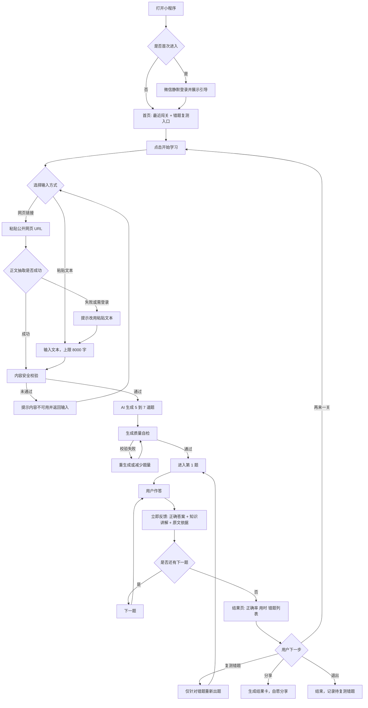
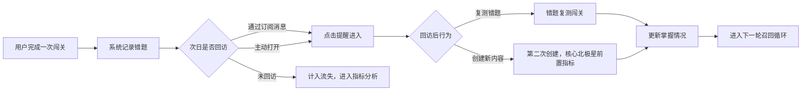
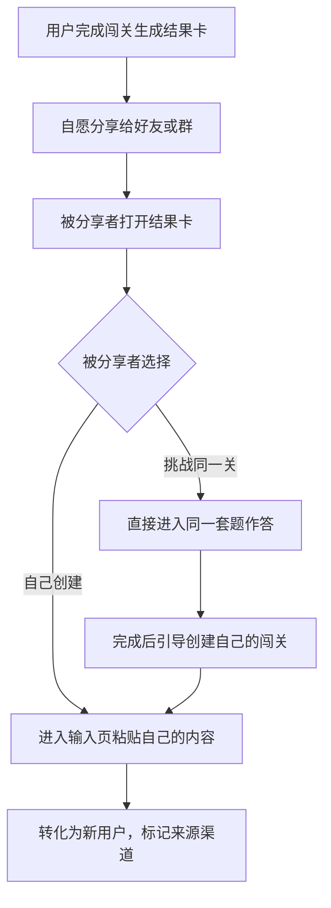

# 需求分析文档

> 文档版本：v1.0　｜　更新日期：2026-08-13
> 竞品与市场证据底稿见 `竞品调研资料.md`，本文档只承载产品决策结论。

---

## 0. 项目概述

**一句话定位：** 微信里最快的「可溯源读后自测」——只根据你粘贴的内容出题，3 分钟完成一关，每道题都能回到原文，明天只复测错题。

| 项目 | 结论 |
| --- | --- |
| 发心 | 帮助大家更快、更轻松地学习任何知识 |
| 载体 | 微信小程序（随时可用、免安装、分享链路短、生态流量入口大） |
| 首批用户 | 泛知识自学者 |
| 首版输入 | 粘贴文本 + 公开网页链接 |
| 知识来源 | 仅限用户提供的内容，不做全网搜索 |
| 核心验证目标 | 用户完成闯关，并且愿意再次创建 |
| 资源约束 | 个人开发，4–8 周上线首版 |

---

## 1. 需求背景

### 1.1 用户问题

传统学习方式以「读完」为终点，但读完不等于学会。用户在微信里读完一篇长文、一份讲义、一段行业资料后，缺少一个低成本的方式确认自己真的读懂了。回头重读成本高、效果差；自己出题给自己考不现实。

学习科学对此有明确支持：主动提取练习优于单纯重读，间隔复习又显著优于集中复习（课堂情境系统综述中 57% 的效应量达到中等或以上；间隔提取相较集中提取汇总效应 g=0.74）。也就是说，**「读完之后测一次、隔天再测错题」这个动作本身是有效的**，缺的是让它变得足够轻。

### 1.2 市场现状与真实机会

「上传资料 → 自动生成测验」已经是 Quizlet、Kahoot、Knowt、Google Gemini Notebook 的标准能力。因此：

- **不成立的假设：** 「AI 能根据资料出题」是差异化优势。这项能力已经商品化，用户甚至可以直接找通用大模型对话完成。
- **成立的机会：** 现有产品都是「学习工作台」形态——要建集合、要选参数、要编辑题库，链路重。没有一个产品是为「微信里刚读完一篇中文长文，想用 3 分钟确认理解」这个瞬时场景设计的。

差异化不是某个单点功能，而是一个组合：**极短首轮 + 严格限源 + 完成优先 + 微信召回 + 中文长文适配**。

### 1.3 关键风险

| 风险 | 说明 | 应对 |
| --- | --- | --- |
| 复用动机弱（最大风险） | 泛知识阅读没有考试日期和课程约束，一次尝鲜不等于二次创建 | 错题次日复测 + 分人群看数，见 6.3 |
| 题目质量不可默认 | LLM 出题总体可用，但证据异质；幻觉会直接损害学习 | 强制原文依据 + 自动校验 + 用户一键纠错 |
| 单位经济性 | 长文本输入 + 用户生成后不答 = 成本全浪费 | 输入长度硬上限、分批生成、首轮只出 5–7 题 |
| 版权与抓取合规 | 用户粘贴 URL 不等于平台获得抓取和再传播授权 | 只抓公开页面、不绕过登录/付费墙、分享页不展示全文 |
| 微信平台规则 | 禁止诱导分享；内容安全不能只依赖自动审核 | 分享全自愿、不做「分享解锁」；接入内容安全接口 |

### 1.4 明确不做的事

首版不承诺「万能 AI 学习平台」。不做全网搜索、不做知识库 RAG、不做视频音频解析、不做多人 PK 和排行榜、不宣称「掌握」或「零幻觉」。原因是这些会把核心验证埋没在解析成本、内容安全和复杂交互里，而个人开发 4–8 周也做不完。

---

## 2. MVP 最小可行功能点

> 原则：一口气能做完、能验证核心假设、砍掉一切不影响验证的东西。

### 2.1 功能清单

| 编号 | 功能 | 具体范围 | 为什么必须有 |
| --- | --- | --- | --- |
| M1 | 微信一键登录 | 静默授权拿到 openid，不强制手机号、不强制头像昵称 | 降低首屏流失；无账号无法统计二次创建 |
| M2 | 内容输入 | 粘贴文本（上限 8,000 中文字）；公开网页 URL 抽取正文。超限提示用户截取重点段落 | 唯一入口，且长度上限直接决定成本 |
| M3 | AI 生成闯关 | 仅依据用户提供内容，生成 5–7 道单选/判断题；每题绑定 `source_span` 原文依据、唯一正确答案、干扰项理由 | 产品核心 |
| M4 | 生成质量自检 | 自动校验四项：答案可被原文支持、只有一个最佳答案、干扰项不与原文冲突、题干不泄露答案。校验失败则重生成或减少题量 | 题目质量是产品信任的底线 |
| M5 | 闯关答题 | 逐题作答，选完立即出结果；答对答错都给知识讲解；顶部显示进度 | 「完成优先」体验的载体 |
| M6 | 原文依据 | 每题解析页可展开对应原文片段并高亮定位 | 核心差异点，也是对抗幻觉的手段 |
| M7 | AI 内容标识 | 题目、解析、结果页明确标注「AI 依据你提供的材料生成，可能有误」 | 合规要求，也管理用户预期 |
| M8 | 一键纠错 | 用户可标记「无依据 / 答案错 / 有歧义 / 太简单」 | 唯一能量化题目质量的通道 |
| M9 | 结果页与结果卡 | 展示正确率、用时、错题列表；生成一张轻量结果卡供自愿分享 | 完成的正反馈 + 自然增长入口 |
| M10 | 错题复测 | 结果页和首页都可对本次错题重新出题复测 | 制造第二次使用的最短路径 |
| M11 | 最近闯关列表 | 首页展示最近 N 次闯关，可继续未完成的、可复测 | 让回访有落点 |
| M12 | 内容安全与隐私 | 接入微信内容安全接口；隐私保护指引；输入内容短保留期与用户可删除 | 上架硬门槛 |
| M13 | 埋点体系 | 完整记录：输入 → 生成 → 首题 → 每题 → 完成 → 复测 → 第二次创建 | 没有埋点等于没有验证 |
| M14 | 人群来源标记 | 记录用户来源渠道，支持按人群分层看留存 | 避免把「人群不对」误判成「产品不行」 |

### 2.2 明确的边界

- 只出单选题和判断题，且题目必须能由单一段落或相邻段落直接支撑。不出需要外部知识、跨文档综合、价值判断、复杂数学推导的题。
- URL 只支持公开可访问页面。遇到登录墙、付费墙、验证码一律不绕过，直接提示用户改用粘贴文本。
- 免费额度限制（如每日 3 次生成）在首版即上线，避免成本失控。
- 不做知识总结长报告、不做学习大盘、不做题库编辑器。

---

## 3. 扩展功能点与优先级

> 优先级判据：**P0 = 核心指标达标后立刻做；P1 = 有明确用户信号再做；P2 = 需要独立立项评估。**

### P0：验证通过后立即补强（预计首版后 2–4 周）

| 功能 | 说明 | 前置条件 |
| --- | --- | --- |
| 次日订阅消息召回 | 「你有 3 道错题待复测」定向提醒 | 需实测微信订阅消息频次与审核要求 |
| 间隔复习调度 | 按答题表现安排复测节奏，而非固定次日 | 错题复测率达标，说明用户接受复测 |
| 题量与难度可调 | 用户可选 5/10 题、简单/进阶 | A/B 已确认默认值，再开放选择 |
| 文档解析（PDF / Word） | 扩展输入格式 | 文本输入的完成率已达标 |
| 付费额度包 | 按次包 / 月卡，先做最简收费 | 免费额度触顶率足够高 |

### P1：有用户信号后再做

| 功能 | 说明 | 触发信号 |
| --- | --- | --- |
| 知识总结与复盘报告 | 通关后生成结构化总结 | 用户主动询问「学完能不能留个东西」 |
| 学习数据后台 | 累计知识点、掌握度、趋势 | 用户已有多次闯关沉淀 |
| 挑战好友 | 把同一份闯关发给朋友比成绩 | 结果卡分享打开率表现良好 |
| 视频链接解析 | 抽取字幕后出题 | 用户反复粘贴视频链接被拒 |
| 知识库 RAG | 固定资料集反复出题 | 出现企业培训 / 考证备考的明确付费意向 |
| AI 生图 | 用于单词、图形类知识的题目与选项 | 明确的品类需求，如英语背单词 |

### P2：需独立立项评估

| 功能 | 风险提示 |
| --- | --- |
| 企业培训 B 端版本 | 商业模式、交付形态与 C 端差异大，应独立立项 |
| 多人实时 PK、排行榜、联赛 | 重投入的动机系统，在留存未验证前做等于空转 |
| 数字人、语音读题 | 成本高、与核心价值弱相关 |
| K12 未成年人市场 | 内容安全、家长信任、隐私要求显著更高，题目出错代价大 |
| 完整 VIP 权益体系 | 在付费意愿未验证前设计复杂权益是浪费 |

---

## 4. 用户操作流程图

### 4.1 主流程：从粘贴到完成闯关

### 4.2 复用流程：次日召回与二次创建

### 4.3 分享带来的新用户路径

> 合规提示：分享全流程必须自愿。不得设置「分享后才能看答案」「分享解锁下一关」等诱导行为，否则违反微信小程序运营规范。

---

## 5. 需求功能核对清单

### 5.1 上线前必须完成（MVP）

**基础与账号**

- [ ] 微信静默登录，拿到并持久化 openid
- [ ] 用户来源渠道标记，支持分层看数
- [ ] 首页：最近闯关列表 + 错题复测入口
- [ ] 首次进入的极简引导，不超过 1 屏

**内容输入**

- [ ] 文本粘贴输入，字数上限 8,000 中文字并有实时提示
- [ ] 超长内容提示用户截取重点段落，不静默截断
- [ ] 公开网页 URL 正文抽取，去除导航、评论、广告
- [ ] 遇到登录墙 / 付费墙 / 验证码时明确提示并降级到粘贴文本
- [ ] 抓取失败、内容过短、内容为空的兜底文案

**AI 出题**

- [ ] 严格限源出题，禁止引入用户材料之外的知识
- [ ] 单次生成 5–7 道单选 / 判断题
- [ ] 每题产出 `source_span` 原文依据、唯一正确答案、干扰项理由、难度标记
- [ ] 生成质量自检四项校验：答案可支持 / 唯一最佳答案 / 干扰项不冲突 / 题干不泄答案
- [ ] 校验失败的重生成与降级题量策略
- [ ] 生成超时、失败的用户提示与重试

**答题体验**

- [ ] 逐题作答，选完即时反馈
- [ ] 答对答错均提供知识讲解
- [ ] 每题可展开原文依据并高亮定位
- [ ] 顶部进度指示
- [ ] 中断后可从上次位置继续

**结果与复用**

- [ ] 结果页展示正确率、用时、错题列表
- [ ] 错题复测入口（结果页 + 首页）
- [ ] 结果卡生成，样式简洁可读
- [ ] 分享路径完全自愿，无任何解锁或奖励绑定

**质量与合规**

- [ ] 题目 / 解析 / 结果页的 AI 生成标识
- [ ] 一键纠错：无依据 / 答案错 / 有歧义 / 太简单
- [ ] 接入微信文本内容安全接口，`REVIEW` 结果走人工确认
- [ ] 隐私保护指引配置，与实际调用的隐私接口一致
- [ ] 用户输入内容的短保留期策略与主动删除入口
- [ ] 提示用户不要粘贴机密、病历、含个人信息的材料
- [ ] 版权投诉入口与域名黑名单机制
- [ ] 明确不宣称「掌握」「学会」「零幻觉」

**成本控制**

- [ ] 输入长度硬上限生效
- [ ] 免费额度限制（建议每日 3 次生成）
- [ ] 题目 JSON 缓存，相同来源哈希去重
- [ ] 单次生成成本与单次完成成本的监控看板

**数据埋点**

- [ ] `generation_success`：后端生成并通过校验
- [ ] `quiz_started`：用户看到并作答第 1 题
- [ ] `quiz_completed`：提交最后一题
- [ ] `retest_started`：开始错题复测
- [ ] `second_creation_7d`：7 天内对另一份输入成功生成并开始作答
- [ ] `question_error_reported` 与人工复核后的 `question_error_confirmed`
- [ ] 机器人、内部测试、重复刷新、分享页旁观者的剔除逻辑

### 5.2 上线后必须验证（继续投入的门槛）

首轮 4–6 周、100–300 名有效新用户，以下指标同时达标才建议继续投入：

- [ ] 生成成功用户的闯关完成率 ≥ 60%
- [ ] 首次生成后 7 天内再次创建新闯关的用户比例 ≥ 20%
- [ ] 题目「错误 / 无依据 / 有歧义」反馈率 < 5%
- [ ] 严重事实错误率 < 1%
- [ ] P50 从粘贴到首题 < 15 秒，P90 < 30 秒
- [ ] 单次完成闯关的变动成本在内部警戒线内（建议 ≤ ¥0.10–0.30，按实际模型报价和完成率重算）
- [ ] 至少一个窄人群（如职业考证、行业培训资料）的二次创建率显著高于泛流量

> 指标未达标时，不应用增加勋章、排行榜或更多输入格式来掩盖。应先定位是题目质量问题、首轮时延问题，还是用户本来就没有复测动机。

### 5.3 上线后需要跑的实验

- [ ] 题量 A/B：5 题 vs 10 题，主看完成率与二次创建率
- [ ] 证据展示 A/B：原文依据默认展开 vs 点击展开
- [ ] 召回 A/B：次日推「复测错题」vs 推「生成新闯关」
- [ ] 价值主张测试：「读后自测」vs「把资料变成游戏」vs「考试速记」
- [ ] 价格敏感测试：免费 3 次/月、按次包、月卡，优先看真实预付信号

---

## 6. 补充说明

### 6.1 技术选型

完整技术方案见 `技术方案.md`，此处只列结论：

- **前端**：微信小程序原生 + TypeScript + TDesign 小程序 `1.16.0`，首版走 WebView 渲染
- **后端**：Python 3.11+ / FastAPI / LangGraph `1.2.11` + LangChain `1.3.x`
- **模型**：主力 `deepseek-v4-flash`（Beta 端点 + strict tool calling），备用 `glm-4.7`
- **部署**：微信云托管，通过 `wx.cloud.callContainer` 走微信私有协议，**免 ICP 备案**
- **数据库**：云托管自带 MySQL

两个对需求实现有直接影响的技术约束：

1. **题目生成必须采用「提交任务 + 轮询进度」而非流式返回。** 小程序没有 `EventSource`，`wx.request` 的超时上限硬性锁死在 60 秒，且退到后台 5 秒未完成会中断，而完整生成流程很可能超过 60 秒。
2. **没有任何模型能保证题目正确，质量必须靠三层校验。** 结构合法性由服务端 strict schema 兜底；题目数量靠 Pydantic 校验加重试；`source_span` 是否真在原文、`answer_index` 是否真的正确，只能靠自建校验节点做原文子串匹配和索引检查。这直接决定 M4 和 M6 两项功能的实现方式。

### 6.2 尚未消除的信息缺口

以下事项在正式投入更多资源前需要补齐，详见 `竞品调研资料.md` 第 13 节：

- 微信生态内同类小程序的真实竞争密度缺少稳定公开索引
- 尚无目标用户访谈、真实输入样本和重复使用队列数据
- 网页抓取授权边界需按域名制定策略并由律师复核
- 算法备案与 AI 生成内容标识的适用范围需专项确认
- 尚未用真实中文材料建立模型质量、时延和成本基准

### 6.3 关于首批用户的一点提醒

首批用户定为泛知识自学者，这是产品定位。但泛知识人群的复购动机天然弱于有考试压力的人群，而「二次创建」恰好是本项目的核心验证指标。因此建议在不改变产品形态的前提下，主动获取一批职业考证 / 行业培训用户作为对照队列（对应 M14 人群来源标记）。这样当留存数据不理想时，能够区分是产品本身不成立，还是流量人群动机不足。

---

## 7. 决策清单

以下三项同时成立，才建议从验证版进入正式开发：

- [ ] 能明确说出首批用户是谁，以及他们每周至少两次从哪里获得待学材料
- [ ] 在 20–30 个真实样本上，人工复核后的严重错误率和生成时延可接受
- [ ] 已观察到用户完成后主动提交第二份材料，而不只是说「挺有意思」

否则应先做用户问题验证，而不是继续扩充「AI 还能生成什么」。
